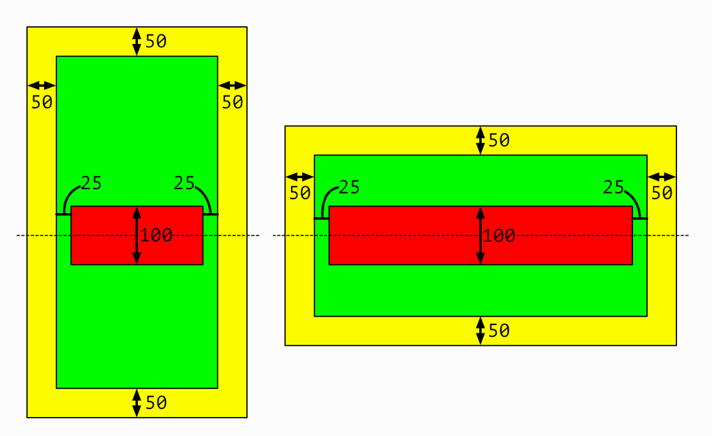

## Challenge I - "Can You Auto Resize?"
### Description

The aim of the first challenge is to create layout using **only Autoresizing** in IB and then in code. Full task as well as the book could be found [here](https://useyourloaf.com/autolayout/).

  
   
  Task expectation

	
	
	 
  	Task results

