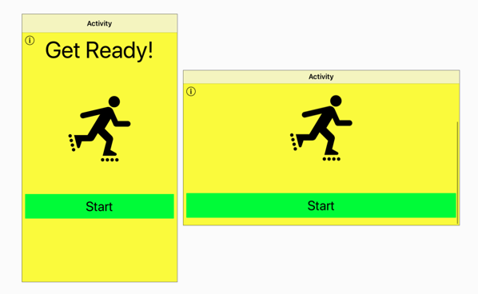
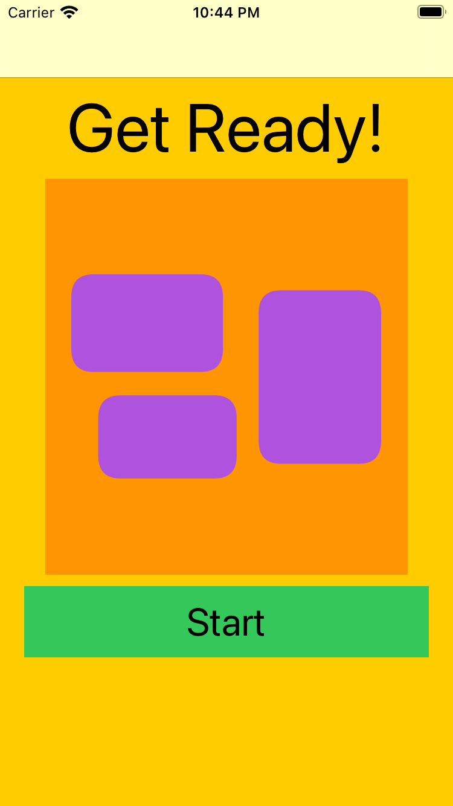
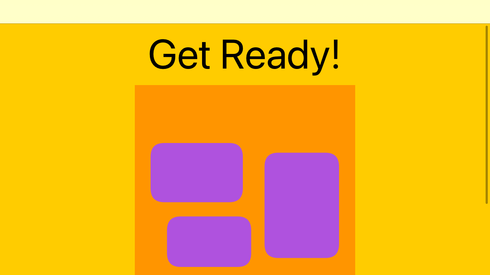
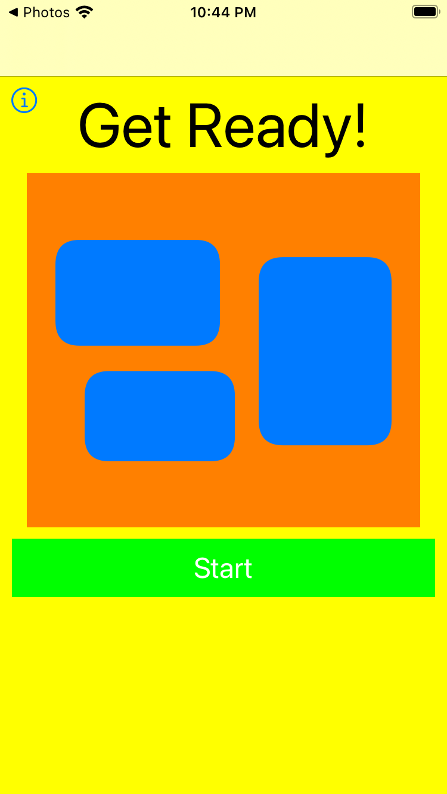
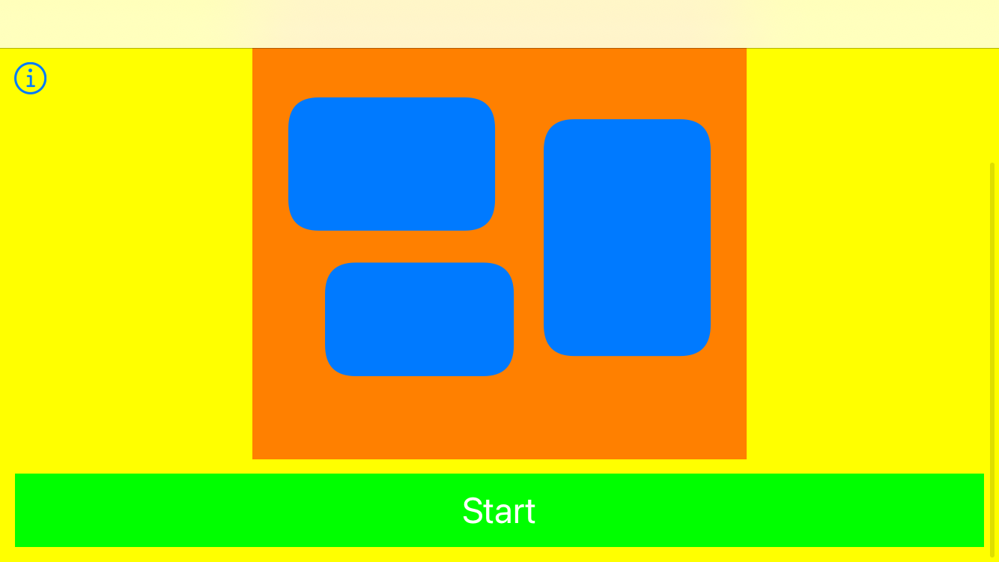
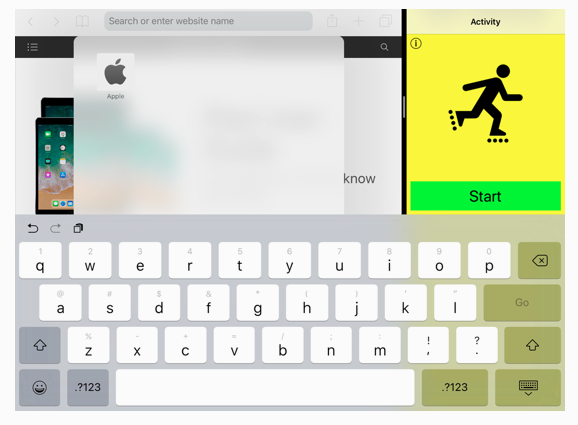
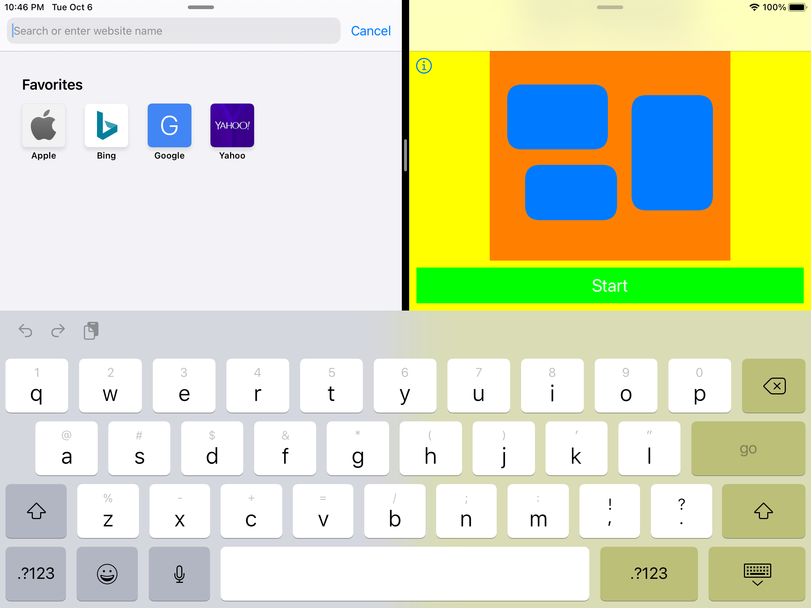

## Challenge XI - "Scroll Views"
### Description

The aim of the eleventh challenge is to practise use of scroll view with different types of containers (UIView, stackView) as well as deal with possible keyboard appearance. Full task as well as the book could be found [here](https://useyourloaf.com/autolayout/).

  
   
  
  
   
  "Scrolling A Stack View” expectation and results

  
   
  
  
   
  "Floating content” expectation and results

  
   
  
   
  "Managing the keyboard” expectation and results

