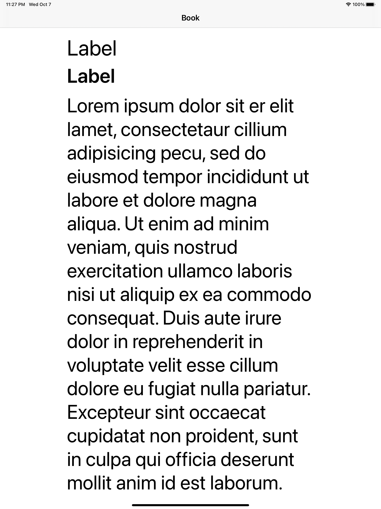
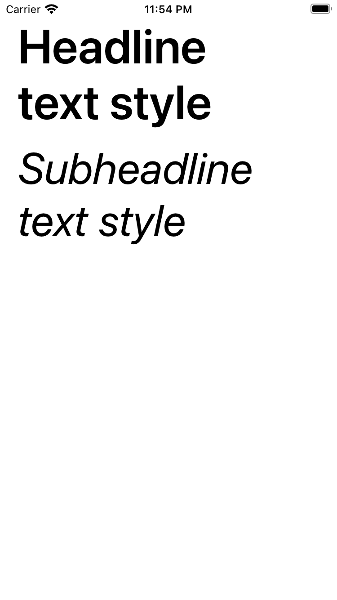
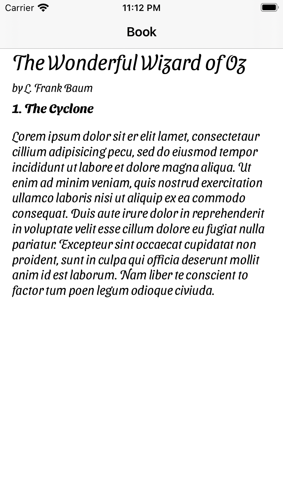

## Challenge XII - "Dynamic type"
### Description

The aim of the twelfth challenge is to practise use of Dynamic Type in terms of using with system, custom fonts and modified with UIFontDescriptor. Full task as well as the book could be found [here](https://useyourloaf.com/autolayout/).

  
   
  "Using Dynamic Type” expectation and results

  
   
  "Changing A Text Style” expectation and results

  
   
  "Changing A Text Style” expectation and results

