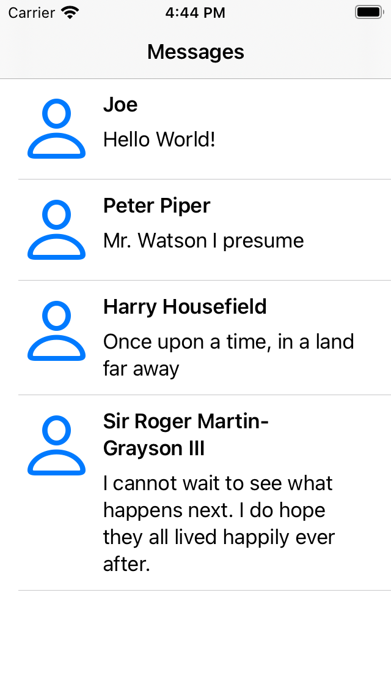
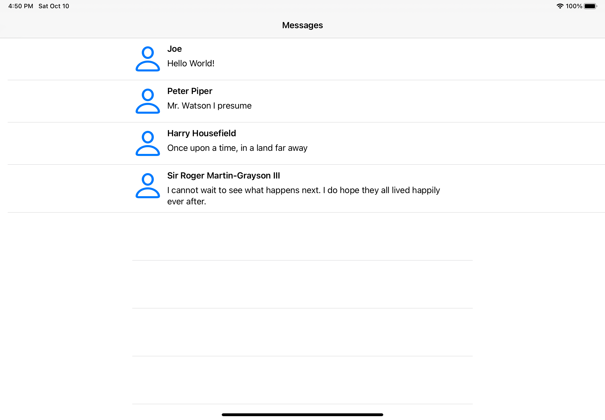

## Challenge XIII - "Table Views"
### Description

The aim of the thirteenth challenge is to use power of autolayout to create self-sizing cells. Full task as well as the book could be found [here](https://useyourloaf.com/autolayout/).

  
  
   
  "Table View” expectation and results

