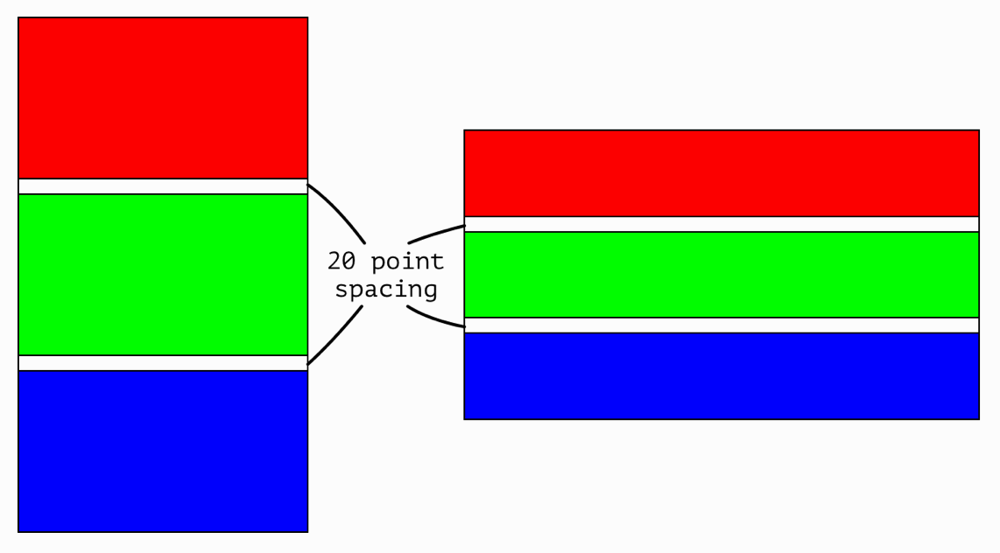
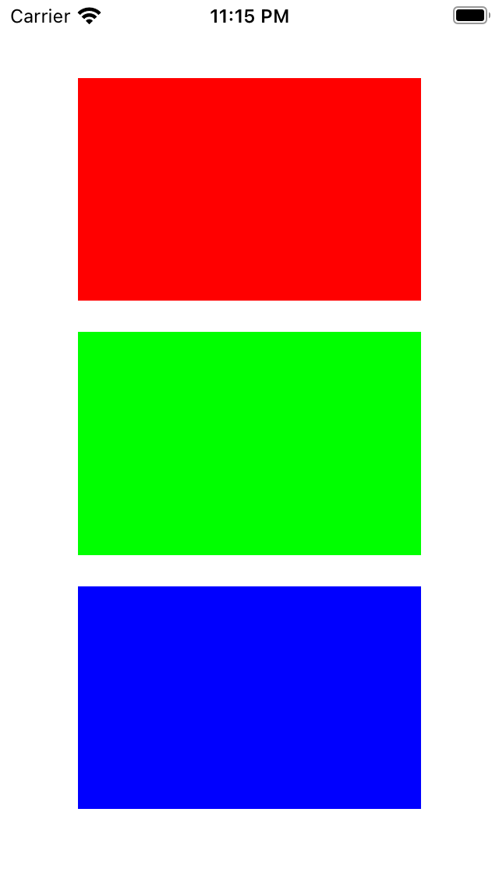

## Challenge III - "Using A Custom View"
### Description

The aim of the third challenge is to create custom UIView in code. Full task as well as the book could be found [here](https://useyourloaf.com/autolayout/).

  
   
  Task expectation

	
	
	 
  	Task results

