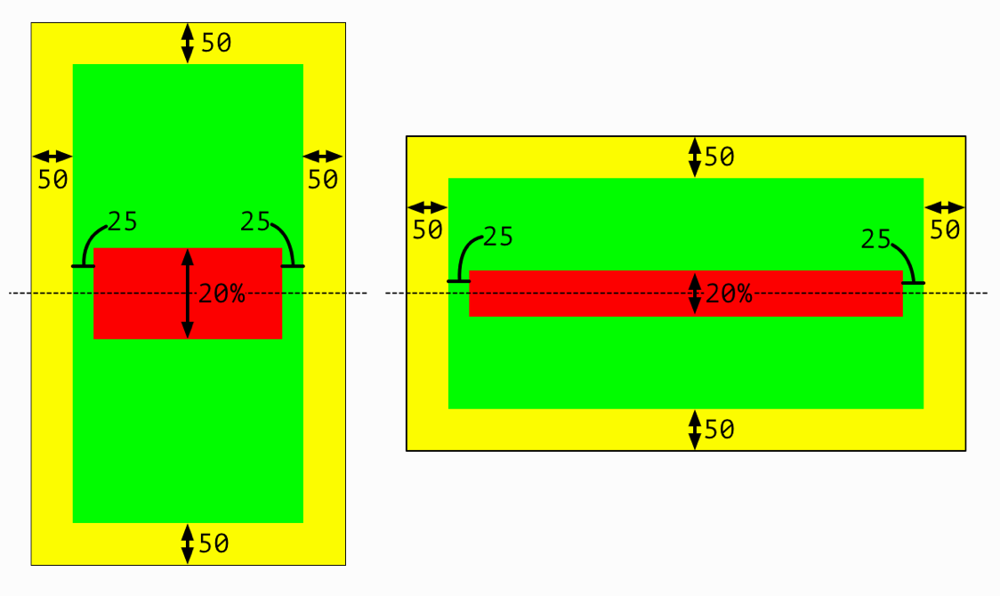
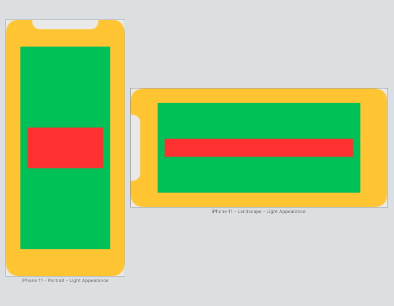
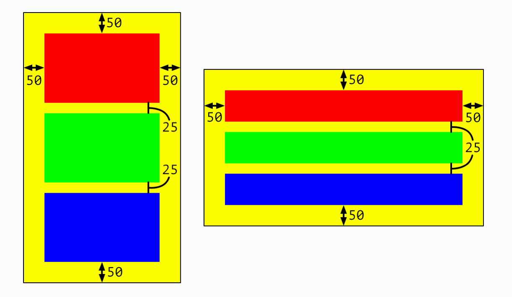
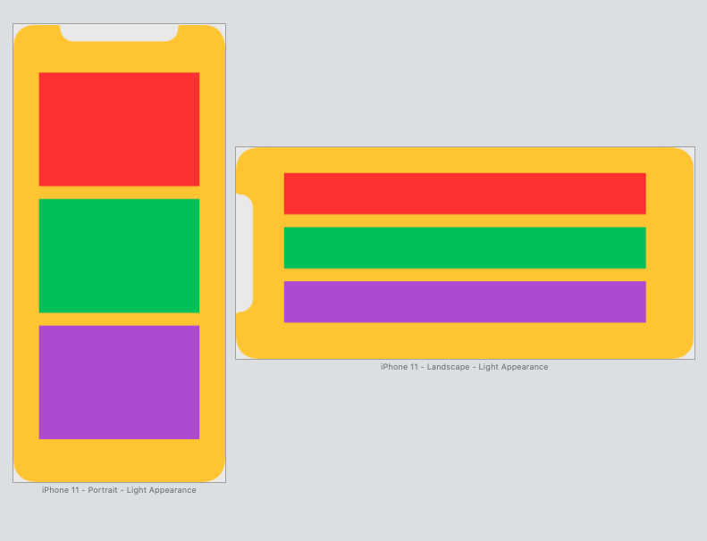
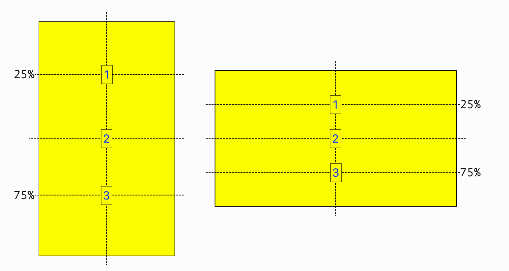
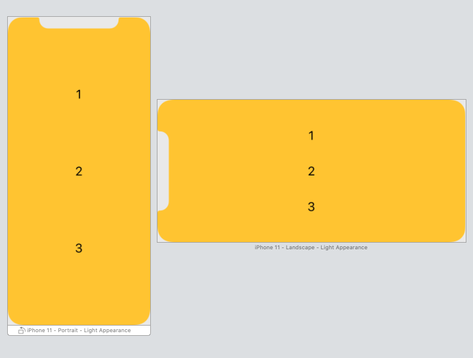
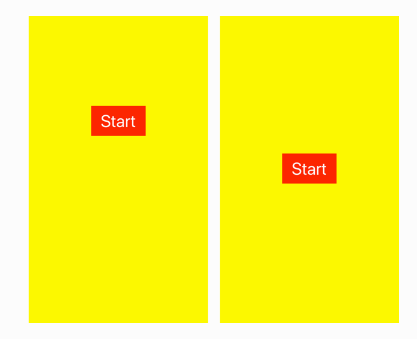
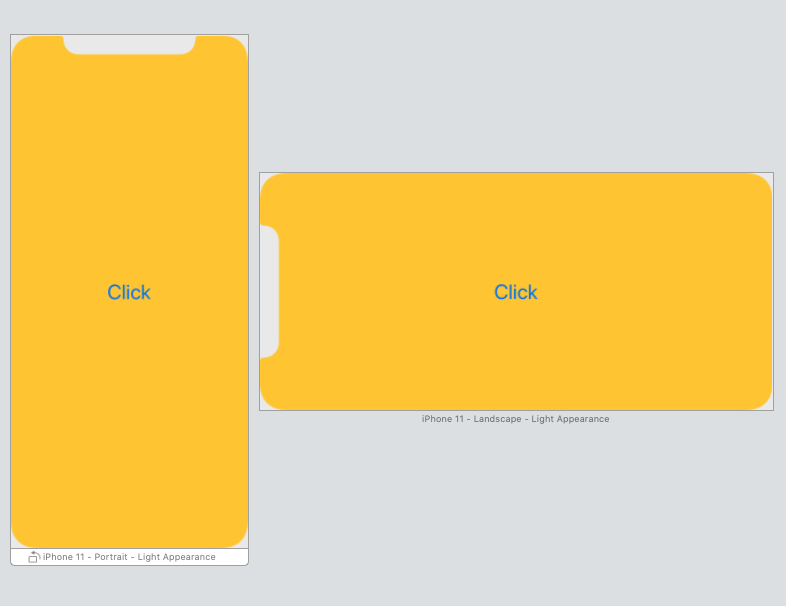

## Challenge IV - "Nested View Layout and more"
### Description

The aim of the fourth challenge is to create multiple layout in IB using autolayout constraints and IB tools. Also, ***Main.storyboard*** contains layout for question about autolayout constraints. Full task as well as the book could be found [here](https://useyourloaf.com/autolayout/).

  
  
   
  "Nested View Layout" expectation and results

  
  
   
  "Sibling View Layout" expectation and results

  
  
   
  "Proportional Centering" expectation and results

  
  
   
  "Changing Constraints" expectation and results

