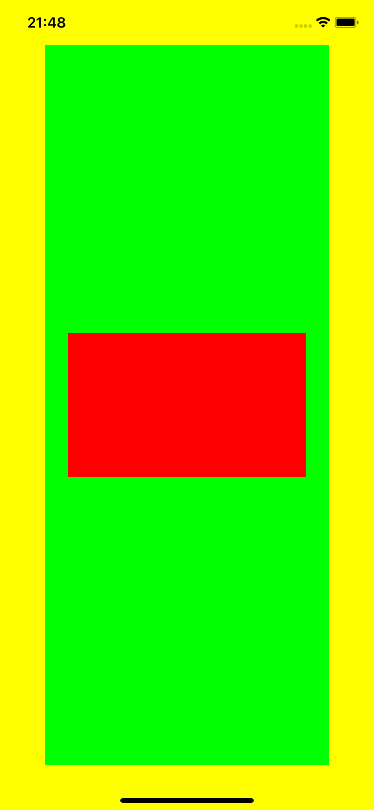
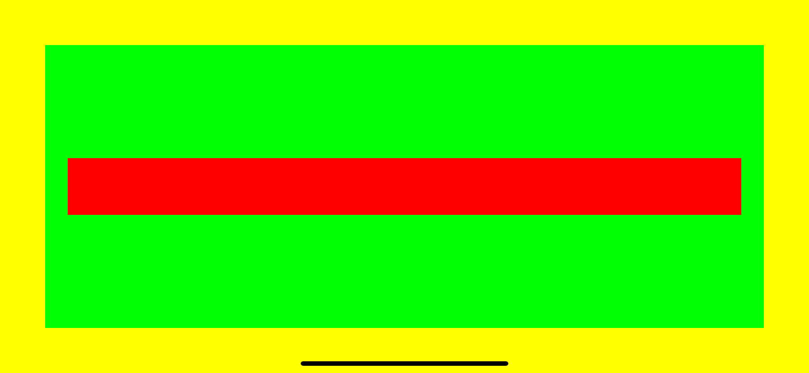
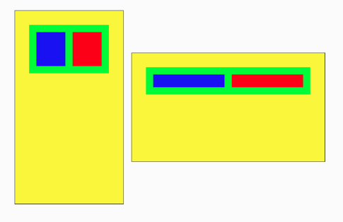
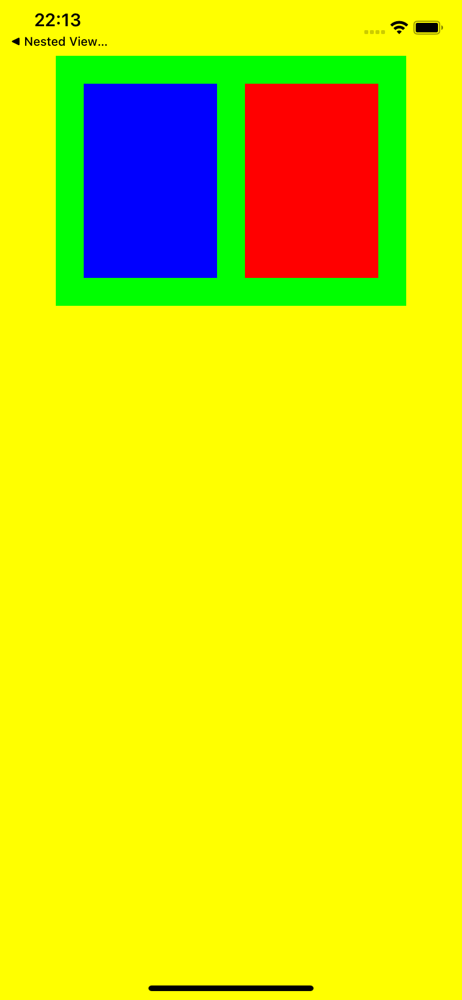
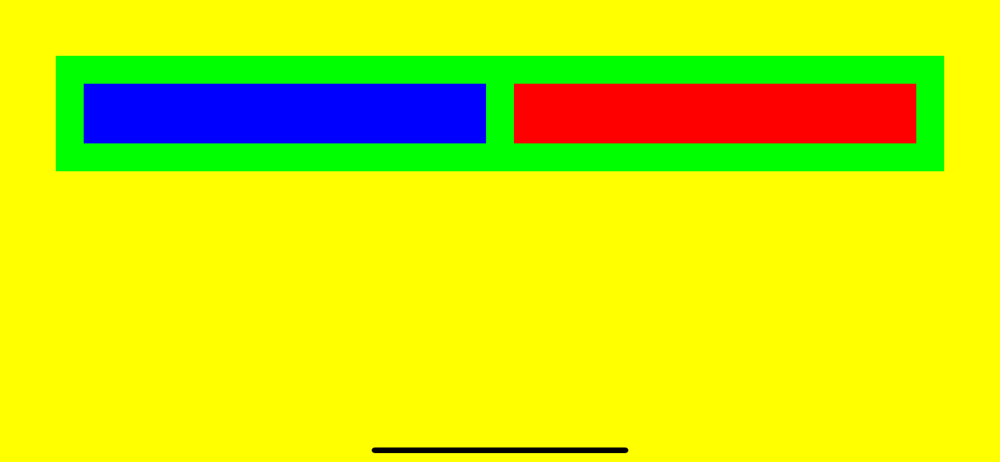

## Challenge V - "Nested View Layout and more in Code"
### Description

The aim of the fifth challenge is to create multiple layouts from part IV in code using autolayout constraints. Full task as well as the book could be found [here](https://useyourloaf.com/autolayout/).

  
   
  
  
   
  "Nested View Layout in code" expectation and results

  
   
  
  
   
  "Tile View Layout in code" expectation and results

