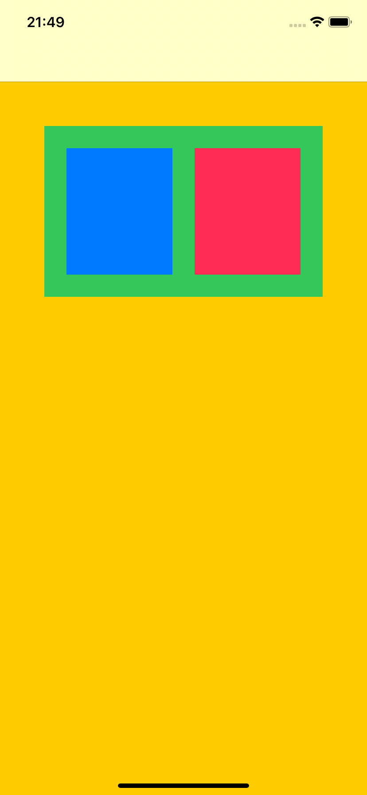
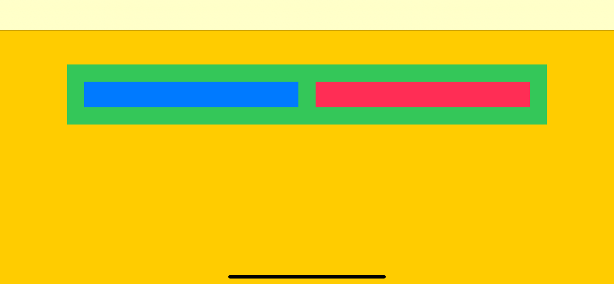

## Challenge VI - "Margins in IB and in Code"
### Description

The aim of the sixth challenge is to create multiple layouts from previous challenges using Margins. Full task as well as the book could be found [here](https://useyourloaf.com/autolayout/).

  
   
  
  
   
  "Margins" expectation and results

