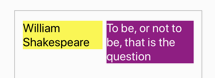
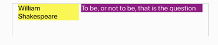
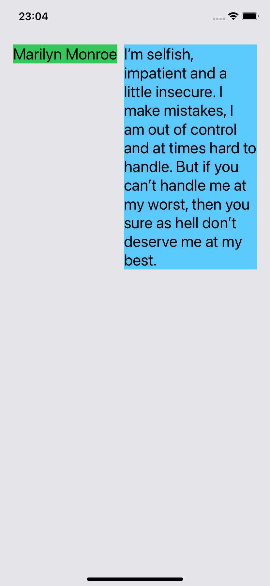
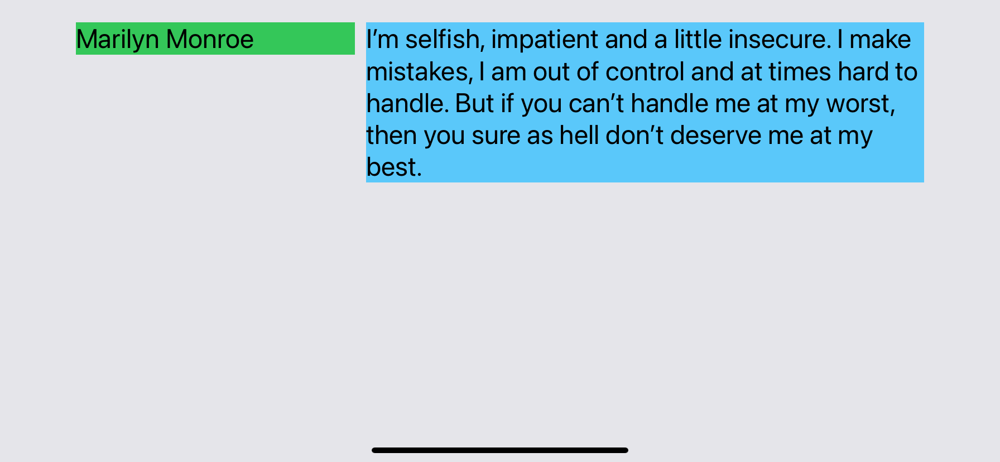
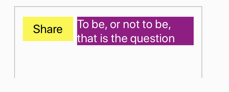
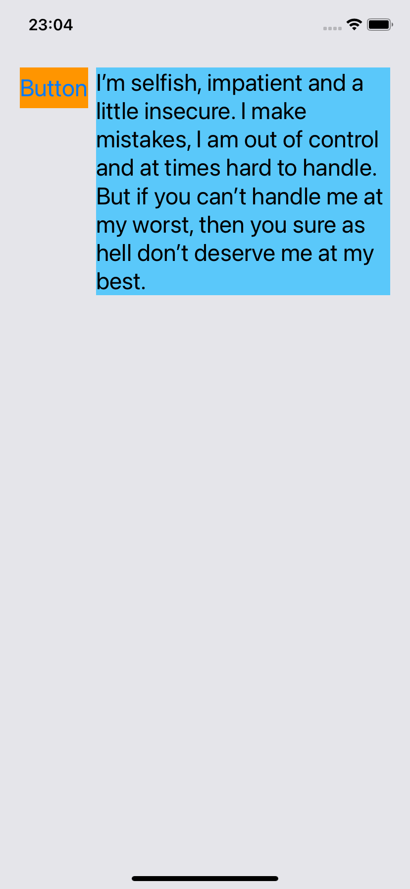
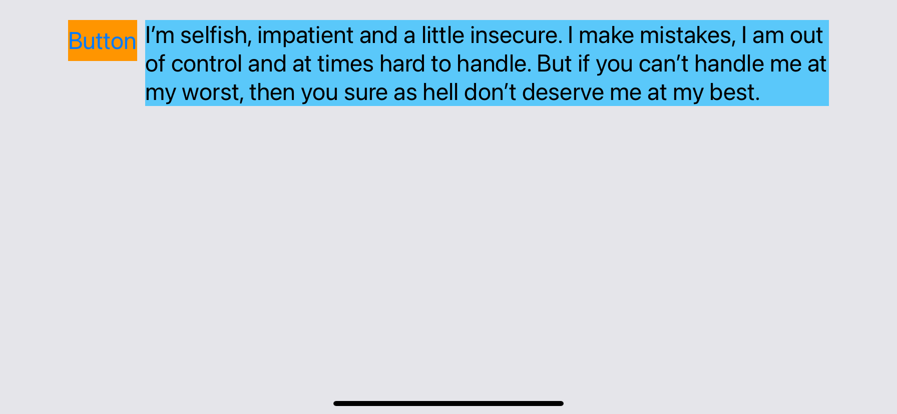
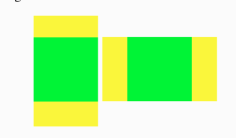

## Challenge VII - "Twice as big if possible and more"
### Description

The aim of the seventh challenge is to study instristic size behaviour and content-resistance-hugging prioprities. Full task as well as the book could be found [here](https://useyourloaf.com/autolayout/).

  
  
   
  
  
   
  "Twice as big if possible” expectation and results

  
  
   
  
  
   
  "Stretch or squeeze?" expectation and results

  
   
  
  
   
  "A big as possible" expectation and results

