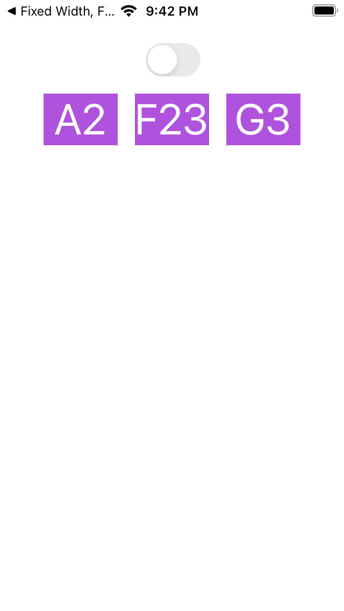

## Challenge VIII - "Stack Views"
### Description

The aim of the eights challenge is to study Stack Views. Full task as well as the book could be found [here](https://useyourloaf.com/autolayout/).

  
  
   
  "Fixed Width, Flexible Height” expectation and results

  
  
   
  "Stretch to fill" expectation and results

  
  
   
  "Stretch to fill" expectation and results

  
  
   
  "Show the secret code" expectation and results

