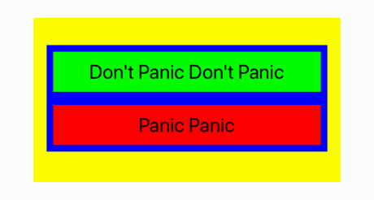
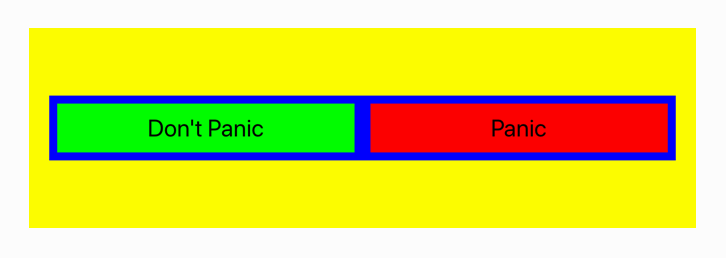
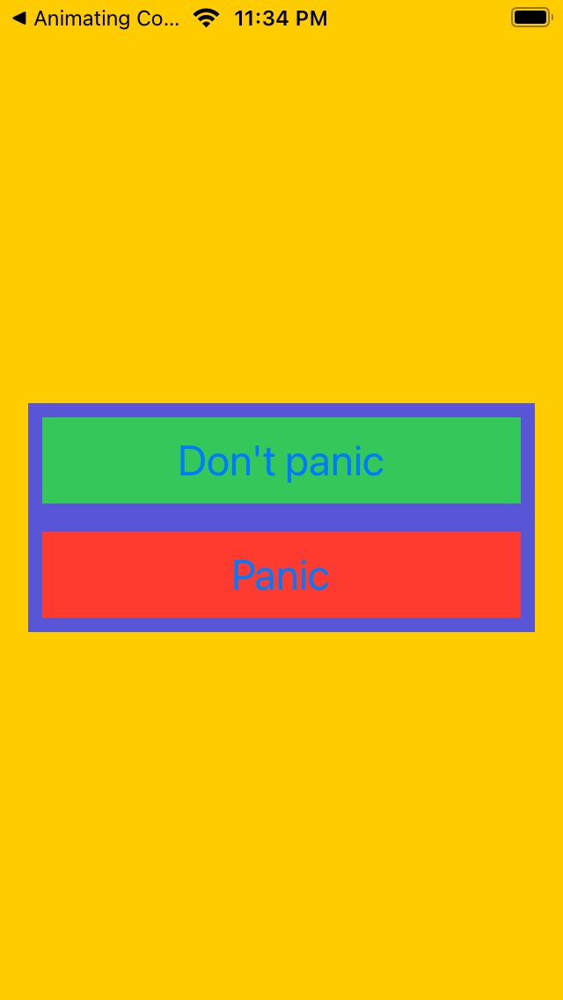
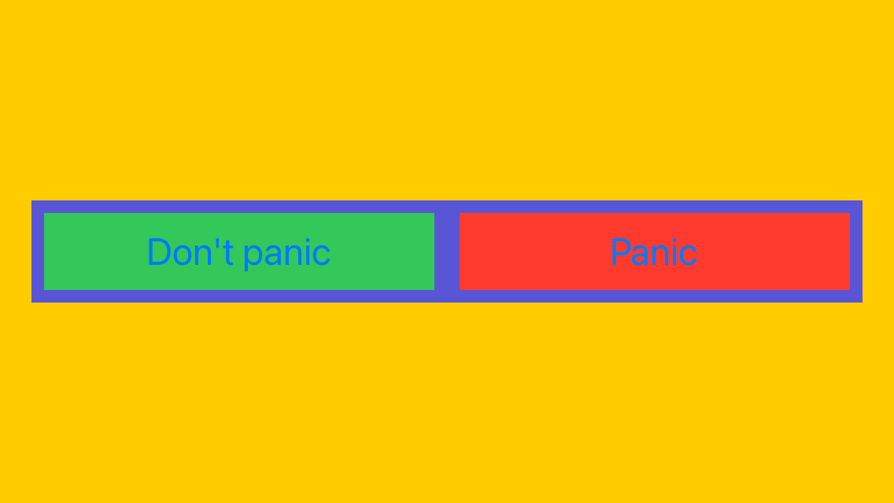
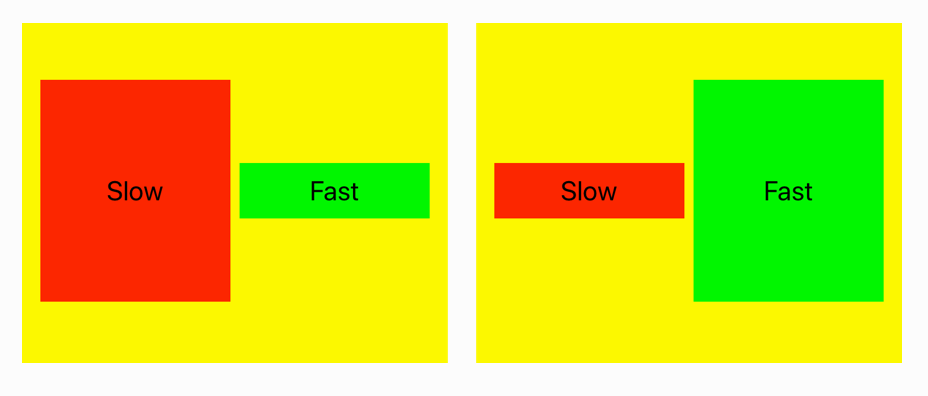
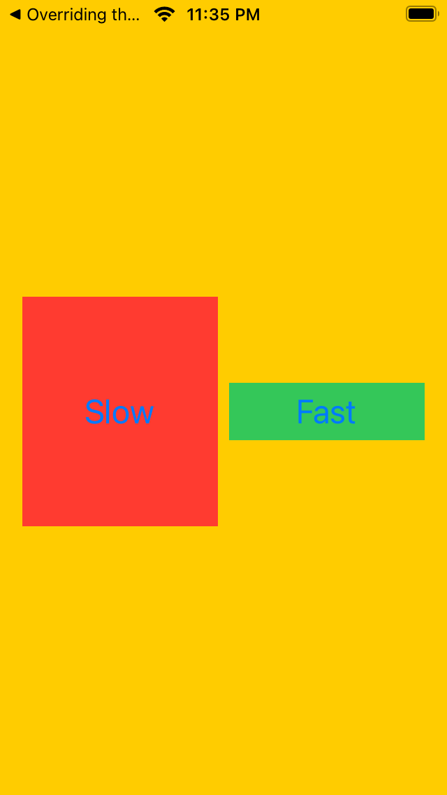
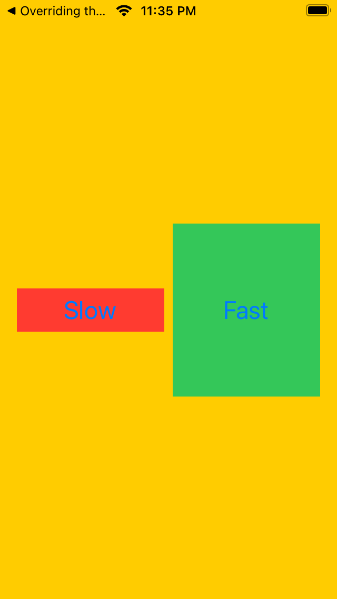

## Challenge IX - "Autolayout Engine Views"
### Description

The aim of the ninth challenge is to practise modifing autolayout engine constraints update and layout update passes. Full task as well as the book could be found [here](https://useyourloaf.com/autolayout/).

  
  
   
  
  
   
  "Animating Constraints” expectation and results

  
   
  
  
   
  "Animating Constraints” expectation and results

